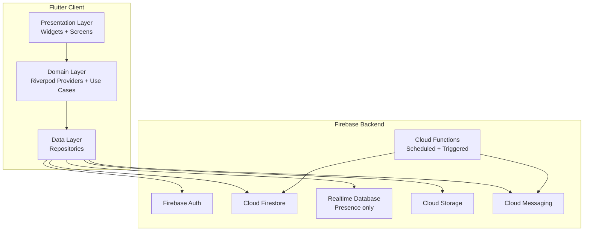

# Design Document: Squircle App

## Overview

Squircle is a private, invite-only social mobile application for close friend groups. It is built with Flutter for cross-platform mobile (iOS and Android) and Firebase as the backend platform. The app combines real-time group chat, shared memory walls, streak-based engagement, event planning, mini-games, mood check-ins, and friend analytics into a single cohesive experience.

### Key Design Goals

- **Privacy-first**: All content is scoped to closed groups; no public discovery.
- **Real-time**: Chat, reactions, polls, and mood feeds update instantly via Firestore streams.
- **Offline-resilient**: Firestore's local persistence and FCM queuing ensure graceful degradation.
- **Scalable feature set**: Feature-first folder structure and Riverpod state management allow independent feature development.
- **Serverless backend**: Firebase Cloud Functions handle scheduled jobs (streak resets, reminders) and heavy fan-out operations (notifications), keeping the client thin.

### Research Findings

- **Firestore vs Realtime Database**: Firestore is preferred for this app because it supports richer querying (needed for analytics, mood feeds, event listings) and subcollection-based data isolation per group. Realtime Database is used only for presence/online-status tracking where low-latency writes matter most.
- **State management**: Riverpod (v2+) is chosen over BLoC for its compile-time safety, built-in async handling, and lower boilerplate. Each feature module exposes its own providers.
- **Navigation**: `go_router` with `ShellRoute` for bottom-navigation persistence and type-safe route parameters.
- **Push notifications**: Firebase Cloud Messaging (FCM) via the `firebase_messaging` FlutterFire plugin. Foreground messages are handled in-app; background/terminated messages use the system notification tray.
- **Streak calculation**: A Cloud Functions scheduled job runs daily at midnight UTC to evaluate streak continuity and reset broken streaks, avoiding client-side clock manipulation.
- **Media storage**: Firebase Cloud Storage with per-group path isolation (`groups/{groupId}/media/`). Client-side file validation (size, MIME type) before upload; server-side Storage Rules enforce the same constraints.

---

## Architecture

The app follows a **feature-first Clean Architecture** with three layers per feature:

```
Presentation  →  Domain  →  Data
(Widgets/UI)     (Use Cases / Providers)   (Repositories / Firebase)
```

### High-Level Architecture Diagram



### Folder Structure

```
lib/
├── core/
│   ├── config/          # Firebase init, environment config
│   ├── router/          # go_router configuration
│   ├── theme/           # App theme, colors, typography
│   └── utils/           # Date helpers, validators, extensions
├── features/
│   ├── auth/
│   │   ├── data/        # AuthRepository (Firebase Auth)
│   │   ├── domain/      # AuthProvider, AuthState
│   │   └── presentation/ # Login, Register, Verify screens
│   ├── profile/
│   ├── groups/
│   ├── chat/
│   ├── memory_wall/
│   ├── streaks/
│   ├── events/
│   ├── games/
│   ├── analytics/
│   ├── mood/
│   └── notifications/
└── main.dart
```

### Backend Services

| Service | Technology | Responsibility |
|---|---|---|
| Authentication | Firebase Auth | Email/phone sign-up, session tokens, password reset |
| Database | Cloud Firestore | All structured data (users, groups, messages, events, etc.) |
| Presence | Firebase Realtime Database | Online/offline status per user |
| File Storage | Firebase Cloud Storage | Avatars, chat media, memory wall photos/videos |
| Push Notifications | Firebase Cloud Messaging | All push notification delivery |
| Scheduled Jobs | Cloud Functions (v2 `onSchedule`) | Daily streak evaluation, event reminders |
| Triggered Functions | Cloud Functions (v2 `onDocumentCreated`) | Fan-out notifications on new messages, posts, events |

---

## Components and Interfaces

### Auth Service

Wraps Firebase Authentication. Supports email/password and phone (OTP) sign-in.

```dart
abstract class AuthRepository {
  Future<UserCredential> registerWithEmail(String email, String password);
  Future<UserCredential> registerWithPhone(String phoneNumber);
  Future<UserCredential> signInWithEmail(String email, String password);
  Future<void> signOut();
  Future<void> sendPasswordResetEmail(String email);
  Stream<User?> get authStateChanges;
}
```

### Profile Service

Manages user profile documents in Firestore (`users/{uid}`).

```dart
abstract class ProfileRepository {
  Future<void> createProfile(UserProfile profile);
  Future<void> updateProfile(String uid, Map<String, dynamic> fields);
  Future<bool> isUsernameAvailable(String username);
  Future<UserProfile?> getProfile(String uid);
  Future<void> deleteAccount(String uid);
}
```

### Group Service

Manages Squircle group documents and membership.

```dart
abstract class GroupRepository {
  Future<String> createGroup(GroupModel group);
  Future<void> updateGroup(String groupId, Map<String, dynamic> fields);
  Future<void> joinGroupByCode(String inviteCode);
  Future<void> joinGroupByLink(String groupId);
  Future<String> generateInviteCode(String groupId);
  Future<void> revokeInviteCode(String groupId);
  Future<void> inviteByEmail(String groupId, String email);
  Stream<List<GroupModel>> watchUserGroups(String uid);
  Stream<GroupModel> watchGroup(String groupId);
}
```

### Chat Service

Manages real-time messages via Firestore streams.

```dart
abstract class ChatRepository {
  Stream<List<ChatMessage>> watchMessages(String groupId, {int limit = 50});
  Future<void> sendMessage(String groupId, ChatMessage message);
  Future<void> addReaction(String groupId, String messageId, String emoji);
  Future<void> pinMessage(String groupId, String messageId);
  Future<void> unpinMessage(String groupId, String messageId);
  Stream<List<ChatMessage>> watchPinnedMessages(String groupId);
  Future<String> uploadAttachment(String groupId, File file);
}
```

### Media Service

Manages Memory Wall posts.

```dart
abstract class MediaRepository {
  Future<void> createMemoryPost(String groupId, MemoryPost post);
  Future<void> deleteMemoryPost(String groupId, String postId);
  Stream<List<MemoryPost>> watchMemoryWall(String groupId);
  Future<void> addReaction(String groupId, String postId, String emoji);
  Future<String> uploadMedia(String groupId, File file, MediaType type);
  Future<void> downloadMedia(String url, String localPath);
}
```

### Streak Service

Client reads streak data; writes are performed by Cloud Functions.

```dart
abstract class StreakRepository {
  Stream<UserStreak> watchUserStreak(String uid, String groupId);
  Stream<GroupStreak> watchGroupStreak(String groupId);
  Future<void> recordActivity(String uid, String groupId); // called on message send
}
```

### Event Service

```dart
abstract class EventRepository {
  Future<String> createEvent(String groupId, EventModel event);
  Future<void> updateEvent(String groupId, String eventId, Map<String, dynamic> fields);
  Future<void> cancelEvent(String groupId, String eventId);
  Future<void> submitVote(String groupId, String eventId, String pollOptionId, String uid);
  Stream<List<EventModel>> watchUpcomingEvents(String groupId);
  Stream<EventModel> watchEvent(String groupId, String eventId);
}
```

### Game Service

```dart
abstract class GameRepository {
  Future<String> startGameSession(String groupId, GameType type);
  Future<void> submitAnswer(String groupId, String sessionId, String uid, String answer);
  Stream<GameSession> watchGameSession(String groupId, String sessionId);
  Future<List<GameResult>> getSessionResults(String groupId, String sessionId);
}
```

### Analytics Service

```dart
abstract class AnalyticsRepository {
  Future<GroupAnalytics> computeGroupAnalytics(String groupId);
  Stream<GroupAnalytics> watchGroupAnalytics(String groupId);
}
```

### Mood Service

```dart
abstract class MoodRepository {
  Future<void> submitMoodCheckIn(String groupId, String uid, MoodState mood);
  Stream<List<MoodCheckIn>> watchMoodFeed(String groupId);
  Future<void> addReaction(String groupId, String checkInId, String reaction);
  Future<bool> hasCheckedInToday(String uid, String groupId);
}
```

### Notification Service

Notification preferences are stored in Firestore; FCM token management is handled client-side.

```dart
abstract class NotificationRepository {
  Future<void> saveFcmToken(String uid, String token);
  Future<void> updatePreferences(String uid, String groupId, NotificationPreferences prefs);
  Future<NotificationPreferences> getPreferences(String uid, String groupId);
}
```

---

## Data Models

All Firestore documents use snake_case field names. Timestamps are stored as Firestore `Timestamp` objects.

### `users/{uid}`

```
{
  uid: string,
  email: string | null,
  phone: string | null,
  display_name: string,
  username: string,           // unique, indexed
  avatar_url: string | null,
  avatar_type: "default" | "photo",
  default_avatar_id: string | null,
  created_at: Timestamp,
  updated_at: Timestamp,
  fcm_tokens: string[],       // array of device tokens
  group_ids: string[]         // denormalized for quick group list
}
```

### `usernames/{username}` (lookup collection)

```
{
  uid: string
}
```
Used for O(1) username uniqueness checks without scanning the `users` collection.

### `groups/{groupId}`

```
{
  group_id: string,
  name: string,
  icon_url: string | null,
  admin_uid: string,
  member_uids: string[],
  invite_code: string,        // unique, indexed
  invite_link_active: boolean,
  created_at: Timestamp,
  updated_at: Timestamp,
  xp: number,
  group_streak: number,
  group_streak_last_active: Timestamp
}
```

### `groups/{groupId}/messages/{messageId}`

```
{
  message_id: string,
  sender_uid: string,
  sender_display_name: string,  // denormalized
  sender_avatar_url: string,    // denormalized
  content: string | null,
  attachment_url: string | null,
  attachment_type: "image" | "video" | "audio" | null,
  reactions: { [emoji: string]: string[] },  // emoji -> [uid]
  is_pinned: boolean,
  created_at: Timestamp,
  delivered: boolean
}
```

### `groups/{groupId}/memory_posts/{postId}`

```
{
  post_id: string,
  author_uid: string,
  author_display_name: string,  // denormalized
  media_url: string,
  media_type: "photo" | "video",
  caption: string | null,       // max 300 chars
  reactions: { [emoji: string]: string[] },
  created_at: Timestamp
}
```

### `groups/{groupId}/events/{eventId}`

```
{
  event_id: string,
  creator_uid: string,
  title: string,
  event_date: Timestamp,
  is_cancelled: boolean,
  poll: {
    options: [{ option_id: string, label: string, vote_count: number }],
    votes: { [uid: string]: string }  // uid -> option_id
  } | null,
  reminder_24h_sent: boolean,
  reminder_1h_sent: boolean,
  created_at: Timestamp,
  updated_at: Timestamp
}
```

### `groups/{groupId}/mood_checkins/{checkinId}`

```
{
  checkin_id: string,
  author_uid: string,
  author_display_name: string,  // denormalized
  mood: "happy" | "sad" | "excited" | "tired" | "anxious" | "grateful",
  reactions: { [reaction: string]: string[] },
  date_key: string,             // "YYYY-MM-DD" for daily uniqueness check
  created_at: Timestamp
}
```

### `groups/{groupId}/game_sessions/{sessionId}`

```
{
  session_id: string,
  game_type: "truth_or_dare" | "who_knows_best" | "trivia" | "spin_wheel" | "guess_photo",
  initiator_uid: string,
  state: "active" | "completed",
  prompt: string | null,
  target_uid: string | null,    // for truth_or_dare, spin_wheel
  questions: GameQuestion[],    // for trivia, who_knows_best
  answers: { [uid: string]: string },
  results: GameResult[] | null,
  created_at: Timestamp,
  ended_at: Timestamp | null
}
```

### `streaks/{uid}__{groupId}` (composite key document)

```
{
  uid: string,
  group_id: string,
  chat_streak: number,
  chat_streak_last_active: string,   // "YYYY-MM-DD"
  event_streak: number,
  event_streak_last_active: string,  // "YYYY-MM-DD"
  badges: string[],
  title: string | null,
  updated_at: Timestamp
}
```

### `groups/{groupId}/analytics` (single document, updated by Cloud Functions)

```
{
  most_active_uid: string,
  most_active_count: number,
  top_media_sender_uid: string,
  top_media_sender_count: number,
  longest_streak_uid: string,
  longest_streak_count: number,
  ghost_member_uids: string[],
  total_memory_posts: number,
  computed_at: Timestamp
}
```

### `notification_prefs/{uid}/groups/{groupId}`

```
{
  chat_messages: boolean,
  memory_posts: boolean,
  events: boolean,
  event_reminders: boolean,
  streak_alerts: boolean,
  game_sessions: boolean,
  mood_checkins: boolean
}
```

### Firestore Security Rules (summary)

- `users/{uid}`: read by authenticated users; write only by the owning `uid`.
- `groups/{groupId}` and all subcollections: read/write only if `request.auth.uid` is in `resource.data.member_uids`.
- `groups/{groupId}/messages`: members can create; only the sender or admin can delete.
- `groups/{groupId}/memory_posts`: members can create; only the author or admin can delete.
- `streaks/{docId}`: read by the owning user; write only by Cloud Functions (Admin SDK).
- `notification_prefs/{uid}/**`: read/write only by the owning `uid`.

---

## Correctness Properties

*A property is a characteristic or behavior that should hold true across all valid executions of a system — essentially, a formal statement about what the system should do. Properties serve as the bridge between human-readable specifications and machine-verifiable correctness guarantees.*

### Property 1: Email and Phone Format Validation

*For any* string submitted as an email address, the Auth_Service SHALL accept it if and only if it conforms to standard email format (RFC 5322 local-part + `@` + domain); and *for any* string submitted as a phone number, the Auth_Service SHALL accept it if and only if it conforms to E.164 format.

**Validates: Requirements 1.3**

---

### Property 2: Duplicate Credential Rejection

*For any* email address or phone number already associated with an existing account, a registration attempt using that credential SHALL be rejected with an appropriate error, and no new account SHALL be created.

**Validates: Requirements 1.4, 1.5**

---

### Property 3: Username Uniqueness

*For any* username that is already taken, a profile creation or update attempt using that username SHALL be rejected, and the existing owner's username SHALL remain unchanged.

**Validates: Requirements 2.2, 2.4**

---

### Property 4: Avatar Upload Validation

*For any* file submitted as an avatar, the Avatar_Service SHALL accept it if and only if its MIME type is one of `image/jpeg`, `image/png`, or `image/webp` AND its size does not exceed 10 MB; all other files SHALL be rejected with a descriptive error.

**Validates: Requirements 3.3, 3.4**

---

### Property 5: Group Name Length Invariant

*For any* group creation or update request, the Group_Service SHALL accept the group name if and only if its character length is between 1 and 50 (inclusive); names outside this range SHALL be rejected.

**Validates: Requirements 4.2**

---

### Property 6: Invite Code Validity

*For any* Invite_Code that has been generated and not yet revoked, joining with that code SHALL add the user to the correct group. *For any* Invite_Code that has been revoked or never existed, joining with that code SHALL be rejected with an error.

**Validates: Requirements 5.4, 5.6, 5.7**

---

### Property 7: Chat Attachment Size Validation

*For any* file submitted as a chat attachment, the Chat_Service SHALL accept it if and only if its size does not exceed 100 MB; files exceeding this limit SHALL be rejected with an error message.

**Validates: Requirements 6.5, 6.6**

---

### Property 8: Pinned Message Count Invariant

*For any* Squircle group, the number of pinned messages SHALL never exceed 10. Any pin request when 10 messages are already pinned SHALL be rejected.

**Validates: Requirements 6.7**

---

### Property 9: Memory Post Media Validation

*For any* file submitted as a Memory Wall photo, the Media_Service SHALL accept it if and only if its MIME type is `image/jpeg`, `image/png`, or `image/webp` AND its size does not exceed 20 MB. *For any* file submitted as a Memory Wall video, the Media_Service SHALL accept it if and only if its MIME type is `video/mp4` or `video/quicktime` AND its size does not exceed 500 MB. All other files SHALL be rejected.

**Validates: Requirements 7.1, 7.2, 7.3, 7.4**

---

### Property 10: Memory Post Caption Length Invariant

*For any* Memory_Post caption, the Media_Service SHALL accept it if and only if its character length is between 0 and 300 (inclusive); captions exceeding 300 characters SHALL be rejected.

**Validates: Requirements 7.5**

---

### Property 11: Memory Wall Ordering

*For any* set of Memory_Posts in a group, the Memory Wall SHALL display them in strictly descending order of `created_at` timestamp — no post SHALL appear before a post with a later timestamp.

**Validates: Requirements 7.6**

---

### Property 12: Chat Streak Monotonicity and Reset

*For any* user and group, if the user sends at least one message on consecutive calendar days, their chat streak SHALL be strictly non-decreasing. If the user misses a full calendar day with no messages, their streak SHALL reset to zero on the following day.

**Validates: Requirements 8.1, 8.2**

---

### Property 13: Streak Milestone Badge Award

*For any* streak value that is a positive multiple of 7, the Streak_Service SHALL award the relevant badge. *For any* streak value that is not a multiple of 7, no new badge SHALL be awarded for that value.

**Validates: Requirements 8.6**

---

### Property 14: Event Poll Vote Integrity

*For any* group member and event poll, submitting a vote SHALL record exactly one vote for that member — subsequent votes by the same member SHALL overwrite the previous vote, not add a second entry. The total vote count per option SHALL equal the number of distinct members who selected that option.

**Validates: Requirements 9.4**

---

### Property 15: Event Title Length Invariant

*For any* event creation request, the Event_Service SHALL accept the title if and only if its character length is between 1 and 100 (inclusive); titles outside this range SHALL be rejected.

**Validates: Requirements 9.1**

---

### Property 16: Poll Option Count Invariant

*For any* poll attached to an event, the Event_Service SHALL accept it if and only if it contains between 2 and 10 options (inclusive); polls outside this range SHALL be rejected.

**Validates: Requirements 9.3**

---

### Property 17: Mood Check-In Daily Uniqueness

*For any* user and Squircle group, the Mood_Service SHALL accept at most one mood check-in per calendar day. Any second submission on the same calendar day for the same group SHALL be rejected with an informative error.

**Validates: Requirements 12.2, 12.3**

---

### Property 18: Notification Preference Enforcement

*For any* user who has disabled a specific notification category for a specific group, the Notification_Service SHALL NOT deliver notifications of that category for that group to that user, regardless of how many triggering events occur.

**Validates: Requirements 13.3, 13.4**

---

### Property 19: Group Content Access Control

*For any* Firestore read or write request targeting a group's data (messages, memory posts, events, etc.), the request SHALL succeed if and only if the requesting user's UID is present in the group's `member_uids` array; all other requests SHALL be denied by Security Rules.

**Validates: Requirements 14.2**

---

### Property 20: Group Creator Membership Invariant

*For any* group creation request, the resulting group document SHALL always contain the creating user's UID in `member_uids` AND the `admin_uid` field SHALL equal the creating user's UID — regardless of any other parameters supplied.

**Validates: Requirements 4.4**

---

### Property 21: Invite Code Uniqueness

*For any* two distinct Squircle groups, their generated Invite_Codes SHALL be different. No two active groups SHALL share the same Invite_Code.

**Validates: Requirements 4.5**

---

### Property 22: Analytics Ranking Correctness

*For any* Squircle group with a set of members and their message counts over the last 30 days, the Analytics_Service SHALL identify the member with the highest message count as `most_active_uid`, the member with the highest media message count as `top_media_sender_uid`, and the member with the highest streak as `longest_streak_uid`. *For any* member with no messages or reactions in the last 14 days, they SHALL appear in `ghost_member_uids`.

**Validates: Requirements 11.1, 11.2, 11.3, 11.4**

---

### Property 23: Group XP Accumulation

*For any* Squircle group, the group's total XP SHALL equal 10 multiplied by the number of calendar days on which the group activity streak was maintained. XP SHALL never decrease.

**Validates: Requirements 8.7**

---

### Property 24: Mood State Validity

*For any* mood check-in submission, the Mood_Service SHALL accept it if and only if the submitted mood value is one of the predefined set: `happy`, `sad`, `excited`, `tired`, `anxious`, or `grateful`. Any value outside this set SHALL be rejected.

**Validates: Requirements 12.1**

---

### Property 25: Memory Post Author Deletion Exclusivity

*For any* Memory_Post, a deletion request SHALL succeed if and only if the requesting user's UID matches the post's `author_uid` (or the user is the group admin). Deletion requests from any other group member SHALL be rejected.

**Validates: Requirements 7.9**

---

### Property 26: Spin Wheel Member Containment

*For any* spin wheel game session in a Squircle group, the randomly selected `target_uid` SHALL always be a UID present in the group's `member_uids` array at the time of selection. A non-member SHALL never be selected.

**Validates: Requirements 10.4**

---

## Error Handling

### Client-Side Validation

All user inputs are validated on the client before any network call to provide immediate feedback:

- **Email format**: validated with a regex conforming to RFC 5322 simplified form.
- **Phone format**: validated against E.164 pattern (`^\+[1-9]\d{1,14}$`).
- **File size and MIME type**: checked using `dart:io` `File.length()` and the `mime` package before upload.
- **Text field lengths**: enforced via `TextInputFormatter` and form validators.

### Firebase Error Mapping

Firebase SDK errors are mapped to user-friendly messages in a central `FirebaseErrorMapper` utility:

| Firebase Error Code | User-Facing Message |
|---|---|
| `email-already-in-use` | "This email is already registered." |
| `phone-already-in-use` | "This phone number is already registered." |
| `user-not-found` / `wrong-password` | "Invalid credentials. Please try again." |
| `network-request-failed` | "No internet connection. Please try again." |
| `permission-denied` | "You don't have access to this content." |
| `storage/unauthorized` | "File upload failed. Check file type and size." |

### Offline Handling

- Firestore's offline persistence is enabled by default; reads serve cached data and writes are queued.
- FCM queues notifications for offline devices and delivers them on reconnect.
- The UI displays a connectivity banner (using `connectivity_plus`) when the device is offline.
- Media uploads are retried automatically using Firebase Storage's resumable upload API.

### Cloud Functions Error Handling

- All Cloud Functions wrap logic in try/catch and log errors to Cloud Logging.
- Scheduled streak functions use idempotency keys (date-based) to prevent double-processing on retries.
- Notification fan-out functions use batched Firestore writes (max 500 ops per batch) to stay within limits.

---

## Testing Strategy

### Unit Tests

Unit tests cover pure business logic and data transformation functions:

- Input validators (`EmailValidator`, `PhoneValidator`, `FileSizeValidator`)
- `FirebaseErrorMapper` — mapping error codes to messages
- Streak calculation logic (date arithmetic, milestone detection)
- Analytics computation functions (most active member, ghost detection)
- Game prompt selection and result computation
- Mood check-in daily uniqueness logic (date key generation)
- Event countdown timer calculation

Framework: Flutter's built-in `flutter_test` package with `mocktail` for mocking repositories.

### Integration Tests

Integration tests verify Firebase wiring using the Firebase Local Emulator Suite:

- Auth: registration, login, duplicate email/phone rejection, password reset
- Firestore Security Rules: member-only access, admin-only operations, cross-group isolation
- Group creation and invite code join flow
- Chat message delivery and reaction updates
- Memory Wall upload and retrieval
- Event creation, poll voting, and result aggregation
- Mood check-in submission and daily limit enforcement
- Notification preference read/write

Framework: `flutter_test` + Firebase Emulator Suite (Auth, Firestore, Storage, Functions emulators).

### Property-Based Tests

Property-based tests verify universal correctness properties across randomly generated inputs.

**Library**: [`fast_check`](https://pub.dev/packages/fast_check) (Dart port of fast-check) or [`dart_test`](https://pub.dev/packages/test) with custom generators. Each test runs a minimum of **100 iterations**.

**Tag format**: `// Feature: squircle-app, Property {N}: {property_text}`

| Property | Test Focus | Generator Strategy |
|---|---|---|
| P1: Email/Phone Validation | `validateEmail()`, `validatePhone()` | Generate valid/invalid email strings; valid/invalid E.164 strings |
| P2: Duplicate Credential Rejection | `AuthRepository.register()` | Generate pairs of credentials, register first, attempt second |
| P3: Username Uniqueness | `ProfileRepository.isUsernameAvailable()` | Generate username strings, register one, check collision |
| P4: Avatar Upload Validation | `AvatarRepository.validateUpload()` | Generate files with random sizes and MIME types |
| P5: Group Name Length | `GroupRepository.createGroup()` | Generate strings of varying lengths (0–100 chars) |
| P6: Invite Code Validity | `GroupRepository.joinGroupByCode()` | Generate valid/revoked/random codes |
| P7: Chat Attachment Size | `ChatRepository.validateAttachment()` | Generate file sizes around the 100 MB boundary |
| P8: Pinned Message Count | `ChatRepository.pinMessage()` | Generate sequences of pin/unpin operations |
| P9: Memory Post Validation | `MediaRepository.validateUpload()` | Generate files with random sizes and MIME types |
| P10: Caption Length | `MediaRepository.createMemoryPost()` | Generate captions of varying lengths (0–400 chars) |
| P11: Memory Wall Ordering | `MediaRepository.watchMemoryWall()` | Generate posts with random timestamps, verify sort order |
| P12: Streak Monotonicity | `StreakService.evaluateStreak()` | Generate sequences of active/inactive days |
| P13: Streak Badge Award | `StreakService.checkMilestone()` | Generate streak values, verify badge at multiples of 7 |
| P14: Poll Vote Integrity | `EventRepository.submitVote()` | Generate sequences of votes from same/different users |
| P15: Event Title Length | `EventRepository.createEvent()` | Generate titles of varying lengths (0–150 chars) |
| P16: Poll Option Count | `EventRepository.createEvent()` | Generate polls with 0–15 options |
| P17: Mood Daily Uniqueness | `MoodRepository.submitMoodCheckIn()` | Generate same-day and cross-day submission sequences |
| P18: Notification Preference | `NotificationService.shouldDeliver()` | Generate preference configs and notification events |
| P19: Group Access Control | Firestore Security Rules tests | Generate UIDs inside/outside group member lists |
| P20: Group Creator Invariant | `GroupRepository.createGroup()` | Generate group creation requests; verify creator is always member and admin |
| P21: Invite Code Uniqueness | `GroupRepository.createGroup()` | Generate N groups; verify all invite codes are distinct |
| P22: Analytics Ranking | `AnalyticsService.computeGroupAnalytics()` | Generate groups with random message/media/streak counts; verify rankings |
| P23: Group XP Accumulation | `StreakService.evaluateGroupStreak()` | Generate streak day sequences; verify XP = active_days × 10 |
| P24: Mood State Validity | `MoodRepository.submitMoodCheckIn()` | Generate valid and invalid mood strings; verify only predefined values accepted |
| P25: Memory Post Author Deletion | `MediaRepository.deleteMemoryPost()` | Generate posts with random authors; verify only author/admin can delete |
| P26: Spin Wheel Containment | `GameService.spinWheel()` | Generate groups with random members; run spin wheel 100+ times; verify target is always a member |

### End-to-End Tests

Critical user journeys are covered with Flutter integration tests using `flutter_driver` or `patrol`:

1. New user registration → profile setup → avatar selection
2. Create group → generate invite code → second user joins
3. Send chat message → verify delivery to other member
4. Upload memory post → verify it appears on wall
5. Create event with poll → vote → verify results
6. Submit mood check-in → verify it appears in feed → attempt second check-in (expect rejection)
